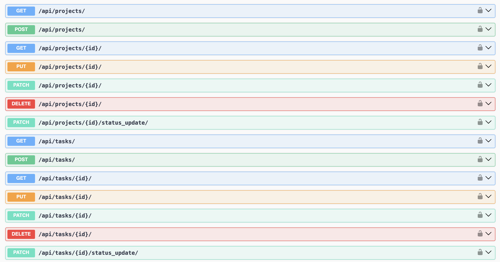

# Django-Umsebenzi

Umsebenzi, which means work in the Zulu language, is a set of simple Django REST apis to manage and keep track of your personal
projects and tasks.

It consists of 2 Endpoints:

* Projects
* Tasks

# Installation
```
pip install django-umsebenzi
```

# Setup

* Add the app `umsebenzi` to `INSTALLED_APPS`
* Umsebenzi uses `DefaultRouter` for its urls. To add it to your main router in your project:
```
from umsebenzi.urls import router as umsebenzi_router 

main_router.registry.extend(umsebenzi_router.registry)
```

Once the urls are connected you will be to view docs if you have the swagger tool for api documentation
There are some examples below to see some of the data that can be created


# Docs
* [Project Api Example](docs/project.md)
* [Tasks Api Example](docs/task.md)

# OpenAPI Endpoints

